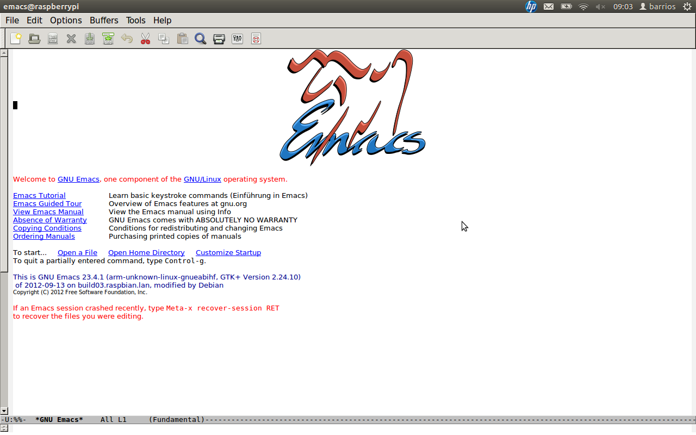

<h2>Table of Contents</h2>

<ul>
<li><a href="#sec-1">1. Wieso nur ausgerechnet Emacs???</a></li>
<li><a href="#sec-2">2. Die Maus ist tot, es leben die shortcuts!</a></li>
<li><a href="#sec-3">3. Auf den Emacs, fertig, los!</a></li>
</ul>

# Wieso nur ausgerechnet Emacs???

Ihr möchtet direkt auf Eurem Raspi coden, aber IDLE gefällt Euch
nicht? Was nun? Die meisten ausgereiften IDEs wie Pycharm etc. sind
echte Ressourcenfresser. Was liegt also näher als das Editorurgestein
emacs für diese Zwecke zu reanimieren?! 

Er ist recht anspruchslos was CPU & Speicher angeht und außerdem
dermaßen flexibel, sodass ihr **alles** ganz nach Gusto konfigurieren
könnt. 

# Die Maus ist tot, es leben die shortcuts!

Was solltet ihr mitbringen, wenn ihr Euch mit emacs anfreunden wollt?
Emacs setzt konsequent auf Tastaturbefehle (shortcuts). Dies braucht
am Anfang ein wenig Eingwöhnung, zahlt sich dann aber durch sehr viel
effizienteres Arbeiten schnell aus, nicht umsonst benutzt jeder
ständig STRG-C STRG-V, oder? 

# Auf den Emacs, fertig, los!

Damit wir erstmal schnell loslegen können, holen wir uns die hoffnungslos veraltete Version 23 aus den Paketquellen:

    sudo apt-get install emacs

Wer sich nicht scheut die aktuelle Version manuell zu compilieren,
hier eine kurze [Anleitung](https://coderwall.com/p/uztyfw). Ihr solltest dann allerdings gleich die
neuste Version 24.3 und nicht 24.2 nehmen (einfach ändern). Es lohnt
sich, da man so neuste Features nutzen kann, ich komme später darauf
zurück&#x2026;